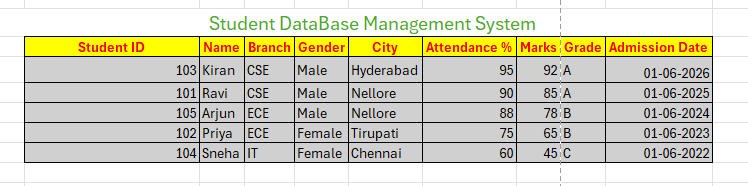

# 📊 Excel Filter Project – Student Database Management System

## 📌 Project Overview

This project demonstrates the practical implementation of Microsoft Excel's filtering and sorting features using a Student Database Management System. The project showcases how Excel can be used to organize, analyze, and retrieve data efficiently through various filter options.

## 🎯 Objectives

- Understand Excel Filters and Sorting.
- Apply different types of filters on a dataset.
- Analyze student records efficiently.
- Improve data management skills using Microsoft Excel.

## 📋 Dataset Information

The dataset contains the following fields:

- Student ID
- Name
- Branch
- Gender
- City
- Attendance %
- Marks
- Grade
- Admission Date

---
## 1️⃣ Original Dataset

**Description:** Complete student database before applying any filters.

---

## 2️⃣ Basic Filter – Branch = CSE

**Description:** Displays only students belonging to the CSE branch.

---

## 3️⃣ Multiple Filters – Female Students from Tirupati

**Description:** Displays records where:
- Gender = Female
- City = Tirupati

---

## 4️⃣ Number Filter – Marks > 80

**Description:** Displays students who scored more than 80 marks.

---

## 5️⃣ Top 3 Filter

**Description:** Displays the top 10 students based on marks.

---

## 6️⃣ Text Filter – Names Starting with "S"

**Description:** Displays students whose names begin with the letter "S".

---

## 7️⃣ Sorting Marks (Highest to Lowest)

**Description:** Student marks sorted in descending order.

---

## 8️⃣ Grade A Students After Sorting

**Description:** Displays only Grade A students after sorting.

---

## 9️⃣ Date Filter (Optional)

**Description:** Displays records filtered by:
- This Month
- Last Month
- Between Dates

---

# 🛠 Tools Used

- Microsoft Excel
- GitHub
- GitHub Markdown

---

# ✨ Features Demonstrated

- Basic Filter
- Multiple Filters
- Number Filter
- Top 3 Filter
- Text Filter
- Date Filter
- Sorting
- Data Analysis

---

# 📚 Learning Outcomes

Through this project, I gained hands-on experience in:

- Data Organization
- Data Filtering
- Data Sorting
- Data Analysis
- GitHub Documentation

---

# 🏁 Conclusion

This project demonstrates how Microsoft Excel filters and sorting techniques can be used to manage, organize, and analyze student data effectively. These features help users retrieve specific information quickly and improve overall productivity in data management tasks.

---

# 👩‍💻 Author

**Nandini Moravaneni**

B.Tech Student | Aspiring AI Engineer | Excel Enthusiast
